#  Emma Spear - Portfolio Task
​
[My portfolio site](https://elspear.github.io/)
​
## Project Requirements

### Content
 Add a short paragraph describing the features below. What aesthetic and technical choices did you make? 
- [x] At least one profile picture
- [x] Biography (at least 100 words)
- [x] Functional Contact Form
- [x] "Projects" section
- [x] Links to external sites, e.g. GitHub and LinkedIn.

My profile picture is located on the first section of my site, the "about me". My bio is over 100 words and gives a general description of who I am, my hobbies, and my job. My contact form is fully functional using FormSpree, and I have tested it myself as well as my brother. My projects section features project name and a small description. The project's name is clickable will take you to my projects page - which will provide more in depth information about my projects. There is also a clickable link in the projects section to see more. I have listed a project I completed during a one day workshop, a project I did on my own for fun, and the creation of my web portfolio. I will be updating with screenshots and links to github soon. My footer has a link to my github profile. I will be including my LinkedIn in the near future, but it's currently an empty profile as I have never needed to use it for my job. 
​
### Technical
 Add a short paragraph describing the features below. What strategies or design decisions did you work from? 
- [x] At least 2 web pages.
- [x] Version controlled with Git
- [x] Deployed on GitHub pages.
- [x] Implements responsive design principles.
- [x] Uses semantic HTML.
The Projects page is my second page, where I get to elaborate on the details of my projects and inclue screenshots. It has the same header as my main page, instead with a home link in place of projects link. The footer is the same as well. My GitHub repository shows I have followed best practice to version track my updates and deployments. I also added a file into my repository from GitHub, so that I could try out pulling and syncing to my local repository. I have used semantic html and media queries so my page is responsive and works for all screen sizes. I have made sure that image aspect ratios aren't changed when resizing, and used rem for font measurements. I have also used Aria labels for accessibility.

### Bonus (optional)
 Add a short paragraph describing the features below, if you included any. 
- [x] Different styles for active, hover and focus states.
- [ ] Include JavaScript to add some dynamic elements to your site. (Extra tricky!)
I implemented hover links which I will show in the screenshots. I plan to implement some JavaScript when I begin to work on my Projects page. I made the header with nav links sticky so that it follows the page. 
​
### Screenshots
### Wireframes
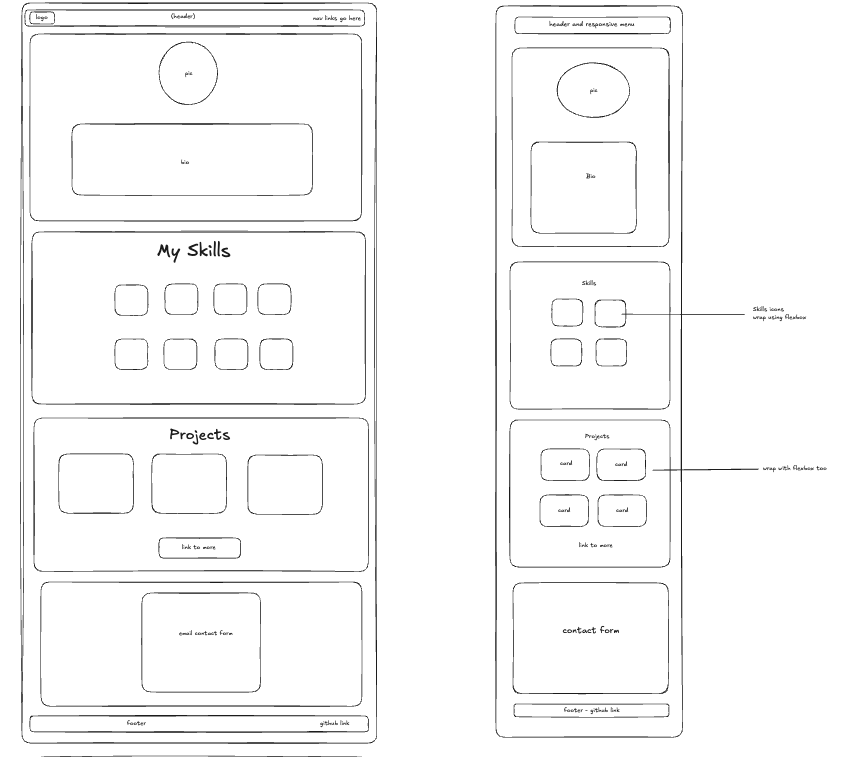
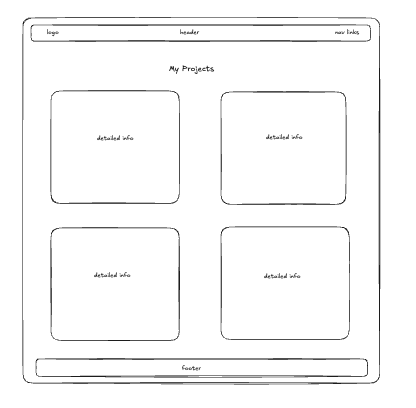

### Desktop Screenshots Homepage
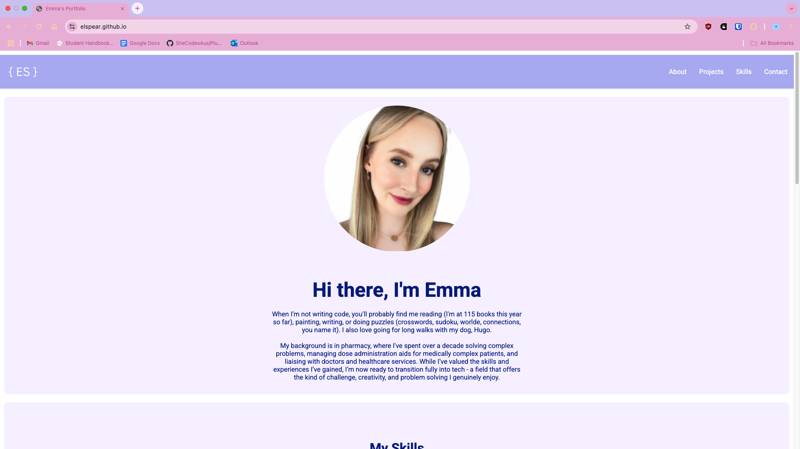
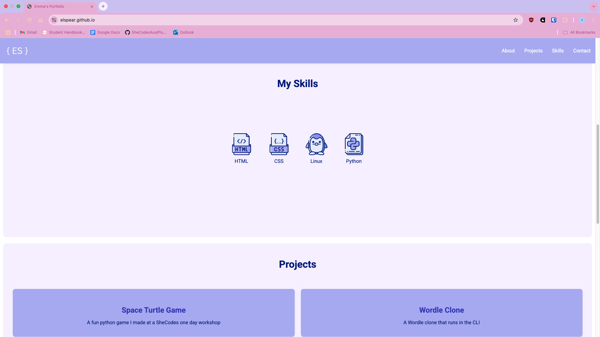
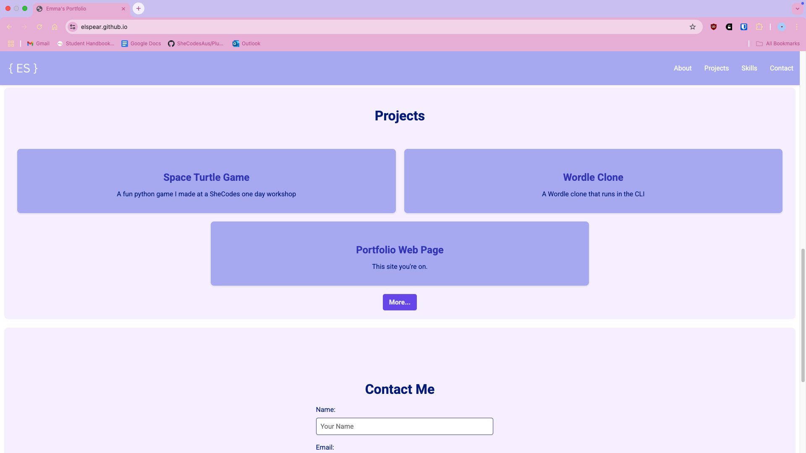
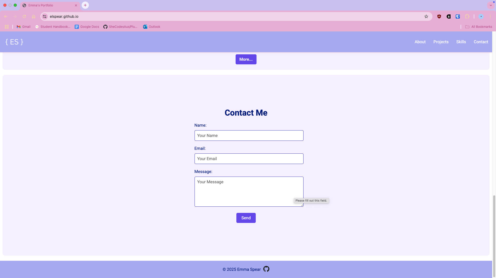

### Desktop Screenshots Projects Page
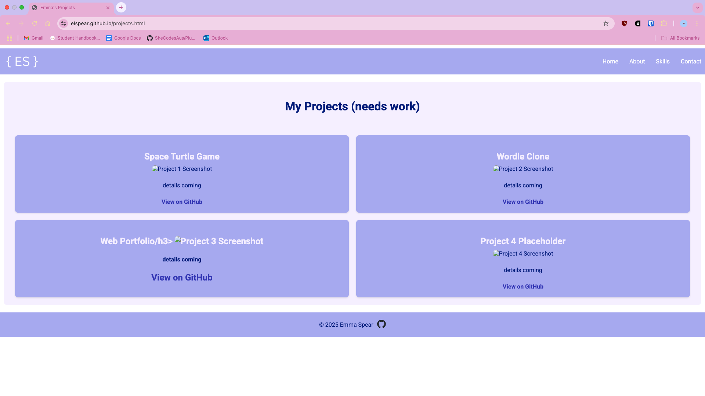

### Mobile Screenshots Homepage
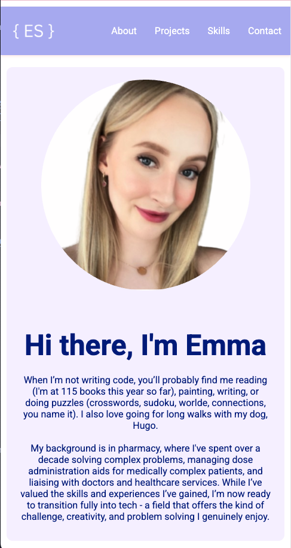
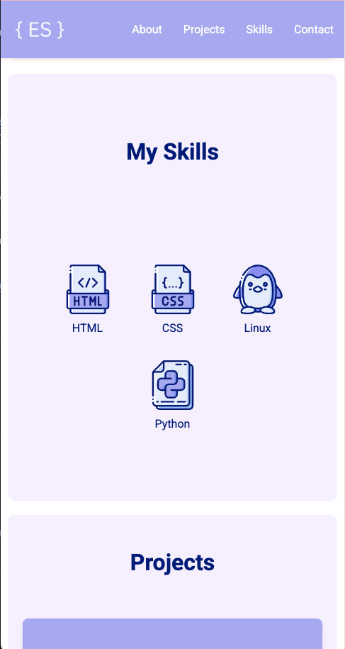
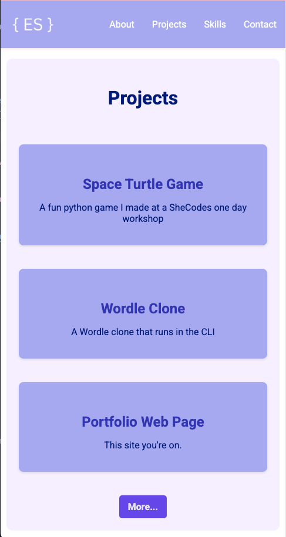
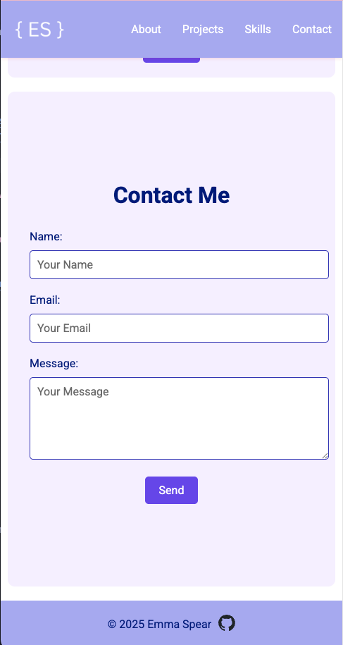

### Mobile Screenshots Projects Page
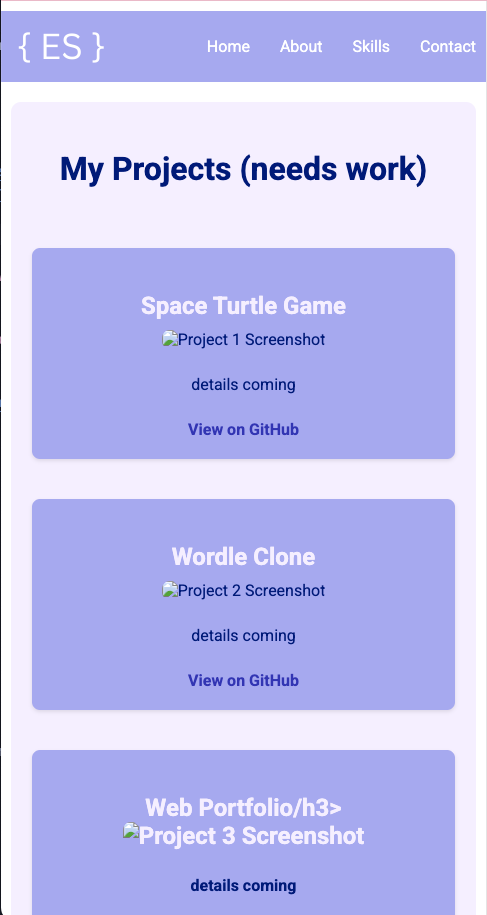
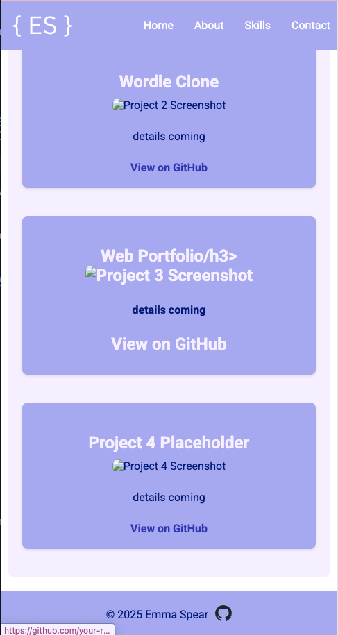

### Desktop Screenshots Hover Links
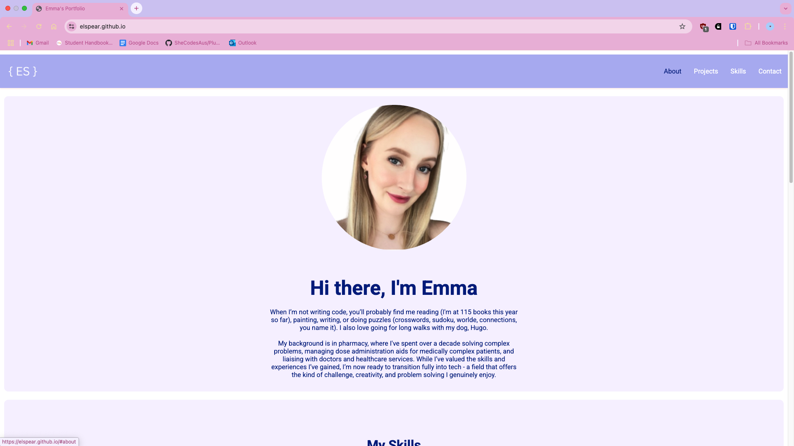
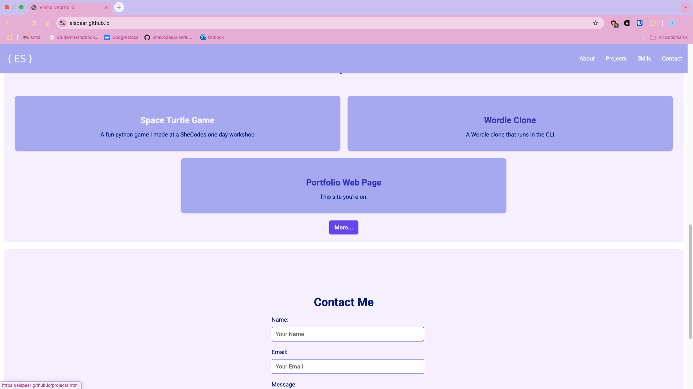
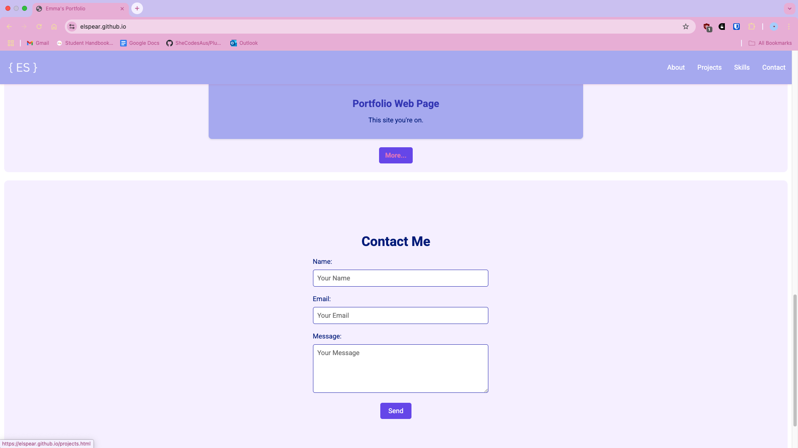

> Please include the following:
> - The different pages and features of your website on mobile, tablet and desktop screen sizes (multiple screenshots per page and screen size).
> - The different features of your site, e.g. if you have hover states, take a screenshot that shows that.  
> 
> You can do this by saving the images in a folder in your repo, and including them in your readme document with the following Markdown code: 

####  image_title_goes_here 

